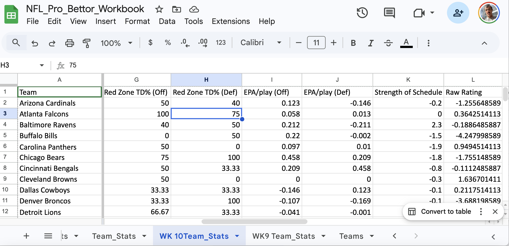
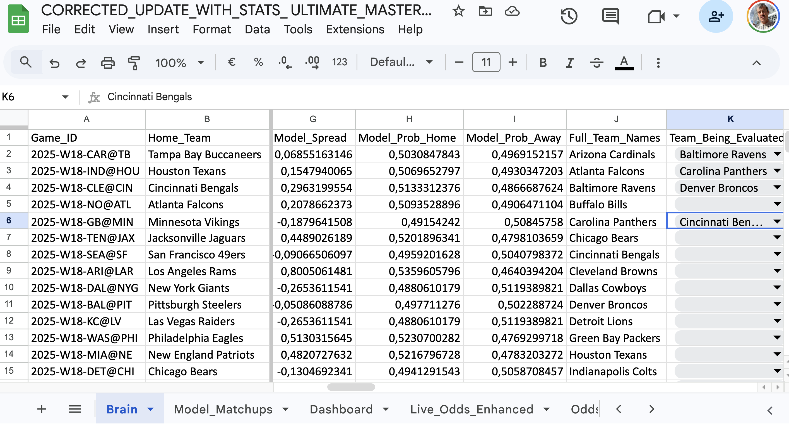
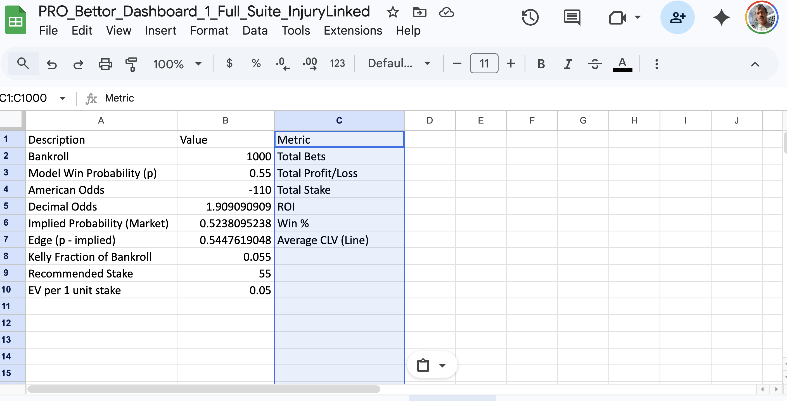
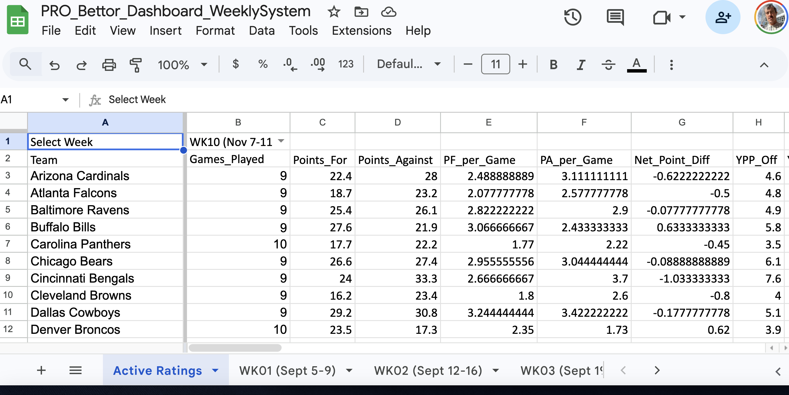

# NFL POWERBOOK — Professional Betting Engine (Case Study)

A public **case study** of a professional-grade NFL betting workflow engine I built (“NFL POWERBOOK”).  
This repo showcases **workflow engineering, automation, and evaluation** while keeping sensitive/proprietary components private.

**What this case study demonstrates**
- Live odds ingestion → normalization → implied probability
- Model probability vs market probability
- Expected Value (EV) + Kelly stake sizing
- CLV tracking + bet logging + settlement history
- Reproducible weekly workflow and clean exports

---

## Walkthrough video

YouTube demo (unlisted): https://www.youtube.com/watch?v=xI88nChjKWU

---

## Why I built it

I wanted a system that treats betting as a **pricing + risk + process** problem:
- not just “pick the better team”
- but **consistently identify mispriced lines**, size stakes responsibly, and evaluate performance over time

This project is also a strong example of what I enjoy building as an **AI Workflow Engineer**: turning messy real-world inputs into reliable outputs (**structured data, exports, repeatable runs**).

---

## What’s included in this public repo

✅ Included
- Architecture + workflow description
- Sample datasets (fake data) that mirror the real schemas
- Output conventions and what each artifact represents
- Screenshots (blurred/redacted)

🔒 Kept private (by design)
- API keys / endpoints
- Proprietary formulas, weights, thresholds
- Personal bankroll info
- Full workbook(s) with production logic
- Any bookmaker account details

---

## Screenshots (blurred/redacted)

These screenshots are intentionally blurred to protect sensitive details (keys, bankroll, proprietary thresholds).

**Required folder:** `docs/screenshots/`  
**Required filenames (exact):**
- `01_overview.png`
- `02_odds_normalization.png`
- `03_ev_kelly.png`
- `04_betlog_settlement.png`
- `05_clv.png` (optional)

### System overview


### Odds normalization


### EV + Kelly recommendations


### Bet log + settlement


### CLV tracking (optional)


---

## Core features

### Odds pipeline
- Ingest live sportsbook odds (moneyline/spread/totals)
- Normalize into a consistent “master feed”
- Convert odds → implied probability

### Model + decisioning
- Compare model probabilities to market implied probabilities
- Compute EV (edge) and flag value opportunities
- Recommend stake sizing with Kelly (or fractional Kelly)

### Tracking + evaluation
- Bet log ledger
- Settlement outputs (win/loss, units, ROI)
- CLV (Closing Line Value) tracking to measure whether bets beat the market

---

## Architecture (high level)

```mermaid
flowchart LR
  A[Live Odds Feed] --> B[Odds Normalization / Master Feed]
  C[Team Stats / Power Ratings] --> D[Model Probabilities]
  B --> E[Implied Probabilities]
  D --> F[EV + Kelly Decisioning]
  E --> F
  F --> G[Bet Log]
  G --> H[Settlement / History Ledger]
  B --> I[Closing Lines]
  G --> J[CLV Tracking]
  I --> J
---

## Weekly workflow (how it runs)

1) **Update odds**
- Pull latest odds and normalize to a master table

2) **Update model inputs**
- Refresh team stats / power ratings
- Generate model probabilities

3) **Compare vs market**
- Market implied probability vs model probability
- Compute EV and select candidates

4) **Size stakes**
- Kelly (or fractional Kelly) based on edge + price

5) **Log bets**
- Store entry lines + odds + timestamp

6) **Track CLV + settle**
- Compare entry line to closing line
- Record results and update history metrics

---

## Sample data (safe, fake)

This repo includes safe fake samples to show schemas and outputs:
- `samples/sample_odds.csv`
- `samples/sample_model_probs.csv`
- `samples/sample_bet_log.csv`
- `samples/sample_outputs.csv`

---

## Outputs (what the engine produces)

Typical artifacts:
- Normalized odds feed
- Model probability table
- EV / Kelly recommendations
- Bet log (entries)
- Settlement ledger (results)
- CLV report (entry vs close)

---

## Responsible note

This project is shared as a workflow/engineering case study. Betting involves risk and variance. Any system like this should be evaluated with careful bankroll management and realistic expectations.

---

## Links

- GitHub profile: https://github.com/mrponyrivers
- Streamlit demos hub: https://share.streamlit.io/user/mrponyrivers
